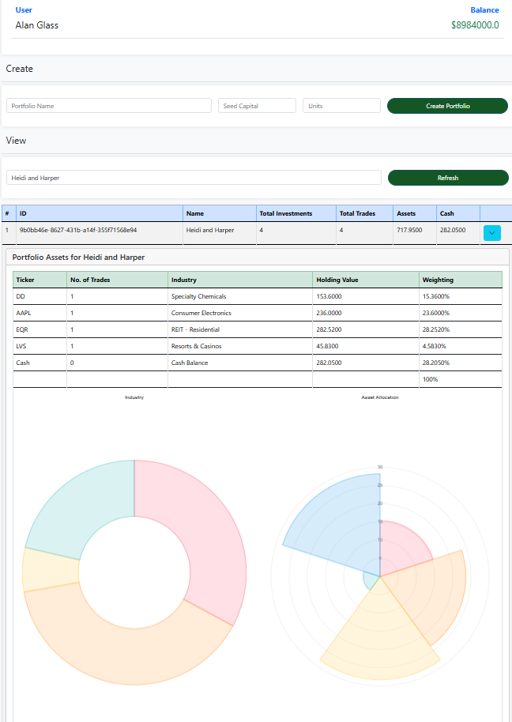

# ucdpa_sql_project

## On Render
    Link to deployment
    https://ucdpa-sql-project.onrender.com/

## Portfolio Dashboard Flask Application with PostgreSQL
Overview
This is a Flask-based web application that allows users to manage a portfolio of stocks. The application enables users to add, remove, and view stocks in their portfolio. Additionally, the application fetches real-time stock prices and other data points (e.g., ISIN) using Yahoo Finance.

## Features
User Authentication: Secure login and session management.
Portfolio Management: Add, remove, and view stocks in your portfolio.
Real-time Data: Fetch live stock data using Yahoo Finance.
Responsive UI: A Bootstrap-based responsive interface that adapts to different screen sizes.
Charts: Chart.js to display Portfolio stats / information
API:  API to retrieve data For Charts
REST API :  API using Serializers in restframework
PAGINATION : Django Pagination -  USERS UI display 3 at a time
SEARCH : SEARCH USERS  -  USING Q Query

## Prerequisites
Before running this application, ensure you have the following installed:

Python 3.x
pip

Installation
## Clone the Repository
    git clone https://github.com/alglass0427/ucdpa_final_project.git`

    cd portfolio-dashboard
## Create and Activate a Virtual Environment

Create a virtual environment to manage dependencies:

    python -m venv venv

Activate the virtual environment:
Windows:
    venv\Scripts\activate

macOS/Linux:
    source venv/bin/activate

## Install Dependencies
Install all required Python packages using requirements.txt:
    pip install -r requirements.txt

## Set Up Environment Variables
Create a .env file in the root directory of the project and add the following environment variables:

makefile

    DEBUG='TRUE'
    DJANGO_SUPERUSER_EMAIL= [email]
    DJANGO_SUPERUSER_PASSWORD= [password]
    DJANGO_SUPERUSER_USERNAME= [username]
    RENDER_HOSTNAME= [hostname]
    SECRET_KEY= [secretkey]
    DATABASE_URL= [DBURL]

## Initialize the Application
You may need to initialize some data or perform migrations (if applicable). If not, you can skip this step.

If the application is in first time use of setting up on a temp SQLLite the static data tables can be updated with provided ".py"
This will check if The database has the required static data For the dropdown inputs, if not the query will insert To the tables

    python manage.py collectstatic
    python manage,py makemigrations
    python manage.py migrate

## Load Assets to DB Tables

    \portfolio_manager\portfolios\management\commands\import_assets.py
        python manage.py import_assets

## Create sample users in DB

    \portfolio_manager\users\management\commands\seed_data.py
    python manage.py seed_data

## DB Entries Can be checked in DBMS
### PGAdmin
    select * from public.portfolios_asset
    select * from public.users_profile

### SQLLite -  Back Up for DEMO
    select * from portfolios_asset
    select * from users_profile

### Run the Application
    cd portfolio_manager
    python manage.py runserver

## Application Structure

### DB Schema

### Project
#### Apps
    charts (api)
    portfolio_manager(project)
    portfolio (app)
    users (app)

        ├───charts
    │   ├───migrations
    ├───portfolios
    │   ├───management
    │   │   └───commands
    │   ├───migrations
    │   ├───templates
    │   │   └───portfolios
    ├───portfolio_manager
    │   ├───management
    │   │   └───commands
    │   ├───static
    │   │   ├───css
    │   │   ├───images
    │   │   └───js
    │   ├───staticfiles
    │   │   ├───admin
    │   │   │   ├───css
    │   │   │   │   └───vendor
    │   │   │   │       └───select2
    │   │   │   ├───img
    │   │   │   │   └───gis
    │   │   │   └───js
    │   │   │       ├───admin
    │   │   │       └───vendor
    │   │   │           ├───jquery
    │   │   │           ├───select2
    │   │   │           │   └───i18n
    │   │   │           └───xregexp
    │   │   ├───css
    │   │   ├───images
    │   │   ├───js
    │   │   └───rest_framework
    │   │       ├───css
    │   │       ├───docs
    │   │       │   ├───css
    │   │       │   ├───img
    │   │       │   └───js
    │   │       ├───fonts
    │   │       ├───img
    │   │       └───js
    │   ├───templates
    ├───README
    └───users
        ├───management
        │   └───commands
        ├───migrations
        ├───templates
        │   └───users
        
# Features

## User Roles

### Not authenticated

    CAN view Users
    CAN send queries to existing users
        USERS Page  -  Send Message
    Can View Site stats in Home Page
        HOME Page  - Uses API to produce Stats And Graphs using chart.js

### Authenticated - Investor

    Can Ivest Own funds from Balance in Profile
    Cannot asset Dashboard
    Cannot Create A Portfolio
    CAN Access Investor Page
    CAN view other Manager Portfolios before Investing
    Reduced Options in NAV bar to reflect access

### Authenticated - Manager

    Can Access Portfolios Page
    Can Access Dashboard -  Only when a portfolio is created
    HAS ALL "Investor" User role permissions

## Portfolios - Manager Access

    
Allows user with Manager Access to Create New Portfolios withe Profile Cash Balance
Allows Managers to view existing portfolio data and allocations in charts and table break fown of weightings
### Create Portfolio
    Creates Cash entry in portfolios_cash table with amount invested as balance
    Reduces Profile Cash balance by amount entered
    Creates an entry in the ASSET table to allow other Managers buy into this portfolio

### View
    Extracts data from db tables with aggregate functions to derive meaningful data points for portfolio Analysis
    Displays data in Bootstrap Table with accordion control per portfolio
    Sub Table displays data in accordion along with rendered chart.js graphs

## Dashboard Manager Access

### Functionality

    Allows managers to add stock investments.
    If ASSET selected is another portfolio created in the app - (denoted by "is_portfolio" tag in ASSET Table)
        	cash amount moved from user portfolio to selected portfolio
            message sent to selected portfolio manager  -  MANAGER TO MANAGER NOTIFICATION with entered Comment
    Creates a portfolio cash entry in the portfolio  to keep All investments segregated

### Y! -  Refresh Toggle
    Turns on and off the fetch yahoo prices for The stocks in the portfolio
    This toggle is controlled tith the Y! -  Refresh switch on the Dashboard(e.g., when adding stocks or using Search).
    If this is set To ON the Application Will refresh all prices in the Portfolio when a new Stock is added
    Alternatively you can leave it  off  - if an svg file has previoulsy been created it will show the data as of created date.
    Turn on to retrieve Data to create the svg to show stock performance etc.

## Stock Symbol - OnCLick
 Once Data is refreshed from Yahoo -  this Will save the to the database while creating a svg xml  (also Saves this to the database for future retieval)

### Select stock from Dropdown  -  
    When selected the the buy Price Field will get the latest price from Yahoo Finance
    If the ASSET is another managers portfolio  -  instead of extracting the Yahoo price , the price is derived from aggregate SQL Query
        SUM of Portfolio Holidings / UNITS
    Enter the Comment
    Enter The amount of stocks to buy

### Click Buy
    Will Add the stock To the select portfolio
    Reduce the amount of capital (volume * buy price)
    If the ASSET is an in App it cash balance will be increased in the investment and balance of Manager portfolio will be decreased

### Click Sell
    Will add the amount back to the capital of the portfolio (volume * sell price)
    Reduce the number of shares of that asset in the portfolio
        If Ticker not in portfolio  -  respond with flash
        If Ticker is in portfolio but input volume > volume in portfolio the n respond

    If the ASSET is an in App it cash balance will be reduced in the investment and balance of Manager portfolio will be increased

### Click Refresh
    Updates the Buy sell price from Yahoo

## Investor UI - Investor and Manager Access

### Create portfolio - Using Profile (Personal Cash)
    Select Portfolio Maanger Name
    Dynamically updated the dropdown with Managers Portfios 
#### View Button
    Displays selected Portfolio Data - 
    Investor Access Alternative to Portfolio (Manager Access) UI
    Can Invest in Existing Portfolios

## USERS / HOME / INBOX
### Users
    Displays Existing Users
    Can Send Messages to Existing Users
    Inbox to View and delete Messages
    SEARCH FUNCTIONALITY  

### Home Screen
    Displays Sample App stats retrieved from In Project API

  

## API

# Points to Note
## SQL

Use of CTE in Portfolio Aggregate Queries

A Common Table Expression (CTE) in SQL is a temporary result set that you can define within a query using the WITH clause. It exists only for the duration of that query and is used to simplify complex queries by breaking them into more readable parts. CTEs are particularly useful when you need to write recursive queries or perform multi-step operations. A CTE can be referenced multiple times within the main query, which makes it easier to manage and maintain code, especially in complex joins, subqueries, or aggregations.

One of the key benefits of CTEs is improved readability and organization. Instead of nesting subqueries, which can make the code difficult to follow, CTEs allow developers to structure their queries in a logical, step-by-step manner. Additionally, CTEs can improve performance by reducing redundant code, especially when the same complex subquery needs to be used multiple times in a query. Recursive CTEs, in particular, enable handling hierarchical or tree-structured data more efficiently, such as organizational charts or category hierarchies.

## Javascript Fetch API use to add / remove update the Database
Fetch The response of of the Routed HTMLS file and then udate the portion of  the table to prevent full page refresh in full render_template

## HTML 

Use of templates to update portions of the web pages retrieved via Javascript API using data- elements from HTML

Dashboard_tbl.html
Portfolio_rows.html
